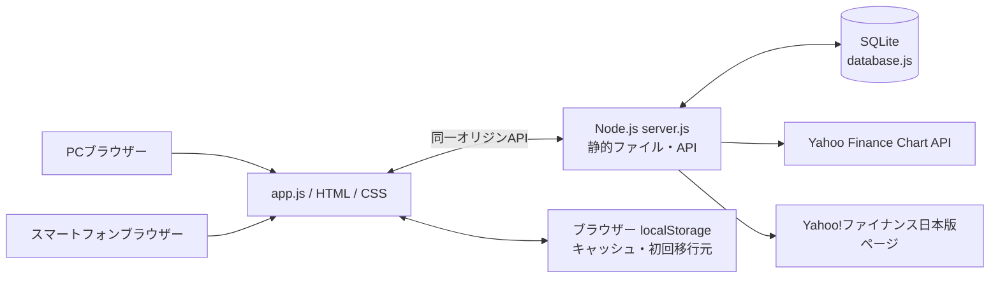
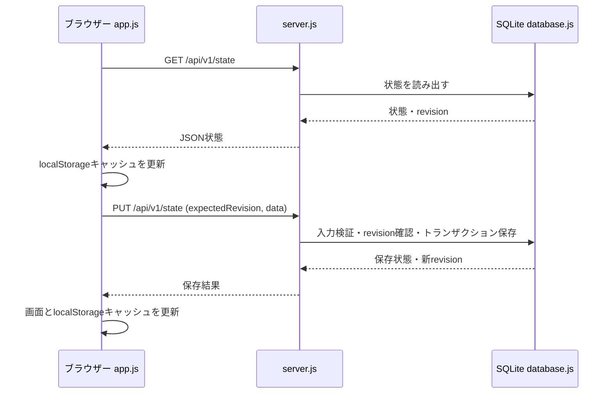

# Asset Compass アーキテクチャ概要

この文書は、リポジトリ内の現在の実装をもとに構成を整理したものです。将来構想とは分け、コードから確定できない点は「要確認」と記載します。

## 目的

証券口座・口座区分ごとの保有資産、価格、評価額、損益、資産推移を管理する個人向けWebアプリです。PCとスマートフォンから同じサーバー上のデータを利用できます。

## 全体構成



## フロントエンド

- `index.html` が画面とフォームのHTMLを持ちます。
- `styles.css` と `funds.css` がレスポンシブ表示を含むスタイルを持ちます。
- `app.js` が画面描画、入力、イベント、API通信、表示用の集計などを担当します。
- `symbols.js` は銘柄コードの保存・表示・Yahoo向け正規化などを共通化します。
- `holding-number-rules.js` は保有数量・取得値の精度ルール、入力検証、共通表示フォーマットをブラウザーとNode.js側で共有します。iDeCoの整数円相当チェックもこのモジュールを使います。
- `asset-goal-simulation.js` は資産目標シミュレーションの計算をUIから分離した共通モジュールです。
- 現時点でフロントエンドのビルド手順や外部UIフレームワークは確認できません。ブラウザーがHTML / CSS / JavaScriptを直接読み込みます。

### `app.js` の主な役割

- TOP、保有資産、口座、資産推移、資産ヒートマップ、資産目標シミュレーションなどの表示
- フォーム入力と表示用フォーマット
- `/api/v1/state` や `/api/quote` などへのリクエスト
- 株価更新、為替レート更新、銘柄情報取得
- 画面上の評価額・損益・配分などの集計
- 価格更新後の表示用スナップショット再取得

価格取得自体の外部サービス通信はブラウザーではなく `server.js` が行います。

### `server.js` の主な役割

- `index.html`、JavaScript、CSS、アイコン、バージョン履歴JSONなど許可された静的ファイルの配信
- 状態取得・保存、LocalStorage初回移行、スナップショット取得などのHTTP API
- 状態保存時の入力・数値精度検証は `database.js` が `holding-number-rules.js` を使って行います。初回LocalStorage移行は既存データ互換を優先し、この通常保存時検証とは別経路です。
- 株価・為替・投資信託価格や銘柄名の取得処理
- `database.js` を通じたSQLiteへの読み書き
- 市況天気用の指数データ取得と集計

通常の起動経路は `start-asset-compass.cmd` からNode.jsで `server.js` を起動する形です。既定ポートは8766で、`ASSET_COMPASS_PORT` で変更できます。

## 保存と同期

### LocalStorage

ブラウザーの `localStorage` には `asset-compass-v1` キーで状態のキャッシュを保存します。現在の実装では、LocalStorageは共通データの正本ではなく、サーバー保存後に更新される便宜的なキャッシュと、初回移行の元データとして使われます。

サーバーにデータがない場合、PC上の既存LocalStorageデータをユーザー操作で一度だけ移行できます。移行済みデータと端末内データは自動統合されず、必要に応じて既存データを別キーのバックアップとして残します。

### SQLite

`database.js` がNode.js組み込みのSQLite APIを使って読み書きします。既定ファイルは `data/asset-compass.sqlite` で、`ASSET_COMPASS_DB_PATH` により保存先を変更できます。

現行スキーマは `PRAGMA user_version` で管理され、現在のコードではバージョン4までの段階的マイグレーションが定義されています。主なテーブルはアプリ状態、口座、保有資産、価格情報、為替レート、日次資産スナップショット、口座別日次スナップショット、口座区分です。

### 保存・同期のおおまかな流れ



保存時にはrevisionを照合し、別端末で先に更新されていた場合の競合を検出します。価格更新時は保存APIにスナップショット情報も渡し、SQLiteで日次の総資産・口座別値を記録します。同じJST日付のスナップショットは更新されます。

## 価格・銘柄情報取得

### 株式・為替

`server.js` の `quote()` がYahoo Finance Chart APIを呼び出します。

```text
https://query1.finance.yahoo.com/v8/finance/chart/{symbol}?range=1mo&interval=1d
```

日本株は `symbols.js` の共通変換を通し、保存上のコードとYahoo向けの`.T`付きコードを分けます。米国株も同じ取得関数を使います。USD/JPYは `JPY=X` を価格更新の対象に含めます。

`quote-data.js` はChartレスポンスの `meta.regularMarketPrice` を現在値として読み、`meta.regularMarketTime`（Unix秒）をUnixミリ秒へ変換します。前日終値は取引所タイムゾーンの日付で日足を並べ、現在の取引セッション直前の有効な足から求めます。

### 投資信託

投資信託は通常の株式Chart取得とは別経路です。`server.js` がYahoo!ファイナンス日本版の銘柄ページを取得し、HTMLから基準価額・日付・銘柄名などを読み取ります。投信コードは半角英数字8文字として扱い、英字は大文字化します。

### 銘柄名の自動取得

- 株式などは `/api/name` からYahoo!ファイナンス日本版の銘柄ページを参照し、ページタイトルをもとに銘柄名を取得します。
- 投資信託は `/api/quote` の投信経路で基準価額とともにページタイトル由来の銘柄名を返します。

取得できない場合は画面上でエラーを示し、銘柄名の手入力が可能です。

### 価格日時と最終取得日時

- 株式・為替の `priceTimestamp` はChart APIの市場時刻由来です。DBではUnixミリ秒で保持されます。
- 投資信託の `priceDate` はYahoo!ファイナンス日本版のページから取得する月日表記です。
- `quoteAttemptedAt` は銘柄ごとの取得試行時刻です。
- `lastQuoteFetchedAt` は価格更新処理全体を終えた時刻で、`Date.now()`由来のUnixミリ秒です。

そのため、市場データ時刻とAsset Compass側の最終取得時刻は別の値です。表示上のタイムゾーン変換はブラウザーの `app.js` にある日時フォーマット処理が担当します。日時関数ごとのタイムゾーン指定が常に統一されているかは要確認です。

## PC・スマートフォン・LANアクセス

画面構造は共通で、CSSのレスポンシブ規則によってPCのサイドバーとスマートフォンの下部ナビなどを切り替えます。スマートフォンは同一LAN上からNodeサーバーへ接続し、PCと同じAPI・SQLiteデータを使います。

`server.js` は既定でループバックアドレスに加え、検出したプライベートIPv4アドレスにも待ち受けます。LAN待ち受けは `ASSET_COMPASS_BIND_LAN=false` で無効にできます。実際に使えるLAN接続先は起動環境のネットワーク設定に依存します。
