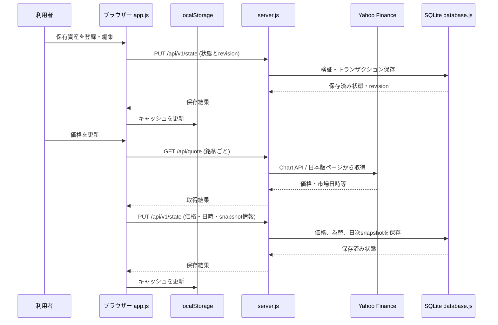

# Asset Compass データ設計

この文書では、現行実装と将来予定の分類情報を分けて整理します。現行フィールドは `app.js`、`database.js`、`server.js` を確認した内容です。v0.2.8での分類項目の保存場所やコード体系は未決定です。

## 現行データ

### 保有資産

アプリ内では価格・価格日時などを含む保有資産オブジェクトを扱います。SQLiteでは基本情報と取得価格情報を別テーブルに保存し、読み出し時にまとめて返します。

| アプリ/APIフィールド | SQLite列 | 意味 |
|---|---|---|
| `id` | `holdings.id` | 保有資産ID。フロントエンドでUUIDを生成 |
| `accountId` | `holdings.account_id` | 証券口座ID |
| `accountCategoryCode` | `holdings.account_category_code` | 口座区分コード |
| `type` | `holdings.type` | 資産種別。現行制約は日本株・米国株・投資信託 |
| `currency` | `holdings.currency` | 価格通貨。現行制約は`JPY` / `USD` |
| `name` | `holdings.name` | 銘柄名 |
| `symbol` | `holdings.symbol` | 銘柄コード / ティッカー。日本株は保存・表示用コードに正規化 |
| `quantity` | `holdings.quantity` | 保有株数・口数。資産種別に応じた精度で保持 |
| `cost` | `holdings.cost` | 通常は取得単価。投資信託では1万口あたり。iDeCoでは取得金額から導く未丸めの派生単価 |
| `price` | `holding_quotes.price` | 取得した現在価格。未取得ならAPI上は`null` |
| `previousClose` | `holding_quotes.previous_close` | 前日終値。取得できない場合は`null` |
| `priceTimestamp` | `holding_quotes.price_timestamp` | 市場価格時刻。Unixミリ秒 |
| `priceDate` | `holding_quotes.price_date` | 投資信託などの価格日付。現行形式は`M/D` |
| `quoteStatus` | `holdings.quote_status` | 価格取得状態。`unknown` / `success` / `failed` |
| `quoteAttemptedAt` | `holdings.quote_attempted_at` | 価格取得試行時刻。Unixミリ秒 |

#### 保存せず表示時に算出する値

以下は保有資産の保存フィールドではありません。

- 評価額：`price × quantity ÷ quantityDivisor`。投資信託の`quantityDivisor`は10,000。USD建ては利用可能なUSD/JPYレートを掛けて円換算します。
- 取得額：`cost × quantity ÷ quantityDivisor`。USD建ては為替を適用します。
- 評価損益：評価額から取得額を差し引いて算出します。
- 評価損益率：評価損益と取得額から表示用に算出します。

したがって「評価額」「評価損益」「評価損益率」はSQLiteの保有資産列として保持していません。

## 数値精度と取得値の意味

新規入力と変更された値には、`holding-number-rules.js` の共通ルールを適用します。許容桁を超えた値は保存前に四捨五入せず、エラーにします。入力文字列の小数桁を数値変換前に検証し、表示は同じ共通formatterでPC・スマートフォンを揃えます。不要な末尾0は表示しません。

| 資産種別 | `quantity` | `cost` / 入力値 |
|---|---|---|
| 日本株 | 整数株 | 取得単価は小数2桁まで |
| 米国株 | 小数4桁まで | USD建ては小数4桁まで、JPY建ては小数2桁まで |
| 通常投資信託 | 整数口 | 1万口あたりの取得基準価額は整数円 |
| iDeCo | 整数口 | 入力・表示する取得金額は整数円 |

### iDeCoの取得金額と派生 `cost`

iDeCoでは取得金額を1円単位の整数として扱います。保存形式に取得金額列は追加せず、既存の `cost` を使います。

```text
cost = 取得金額 ÷ 保有口数 × 10,000
取得金額 = cost × 保有口数 ÷ 10,000
```

`cost` は計算・保存用の派生値であり、整数や固定小数桁へ丸めません。画面で取得金額を復元する際は整数円に正規化します。API / SQLiteへの通常保存では、復元される金額が整数円相当か検証し、計算に伴う浮動小数点誤差だけを許容します。

### 既存値と互換性

- 初回LocalStorageからSQLiteへの移行は旧データを保護し、精度検証による一括拒否・丸め・正規化を行いません。
- 保存済みの値は、編集画面を開いただけでは変更しません。
- 既存の規則外 `quantity` / `cost` ペアは、値とその意味が変わらなければ保持できます。銘柄名など別項目のみの編集では、このペアを強制修正しません。
- `quantity` または `cost` が変更された場合は、新しい精度ルールとiDeCo整数円相当チェックを適用します。
- 既存のLocalStorage・SQLiteフィールド、DBスキーマ、snapshot形式は変更していません。

### 分類・銘柄変更時のフォーム動作

- 数値の意味・単位が変わる資産種別変更と通常投資信託↔iDeCo変更では、数量と取得値を消去します。相互換算はしません。
- 通貨変更では数量を維持し、取得値を消去します。証券口座だけ、またはiDeCoを伴わない口座区分だけの変更では数量・取得値を維持します。
- 正規化後の銘柄識別子が確定済み銘柄から別銘柄へ変わると、銘柄名・数量・取得値を引き継ぎません。新規登録では初回銘柄確定前のコード修正で値を消しません。
- 銘柄情報取得の古い応答は、現在のフォーム・編集対象・資産種別・銘柄と一致しない場合に反映しません。
- 数量と取得値の入力エラーは項目別に管理し、片方を直しても他方のエラー表示を維持します。分類変更による値の消去やフォーム再表示時には古いエラーを解除します。

### 口座と口座区分

口座オブジェクトの主なフィールドは`id`、`name`、`note`です。SQLiteの`accounts`には作成・更新時刻もあります。

口座区分は`account_categories`で管理し、現行データには`code`、`label`、`sort_order`、`is_active`があります。保有資産は`accountCategoryCode`で区分を参照します。

### アプリ全体の状態

現行APIの状態データには、主に以下が含まれます。

- `accounts`
- `accountCategories`（SQLiteの区分定義から読み出される）
- `holdings`
- `usdJpyRate`
- `usdJpyTimestamp`
- `lastQuoteFetchedAt`

`lastQuoteFetchedAt`や`usdJpyTimestamp`はUnixミリ秒です。SQLiteの`app_state`にはrevision、初期化状態、最終価格取得時刻、更新時刻を保存します。為替のレート・時刻は`fx_rates`に保存します。

## LocalStorage

| 項目 | 現行実装 |
|---|---|
| キー | `asset-compass-v1` |
| 保存内容 | 最後にサーバーから受け取った状態のキャッシュ。口座、保有資産、口座区分、為替、最終取得時刻など |
| 用途 | サーバー状態の便宜的なキャッシュ、および初回SQLite移行時の元データ |
| 更新タイミング | サーバー状態を適用した時。サーバー保存成功後の状態適用でも更新 |
| 初回移行 | `/api/v1/migrate-local-storage`へ送信。サーバーが未初期化の場合に移行 |
| バックアップ | 既存の端末データとサーバーデータが異なる場合、`asset-compass-v1-pre-sync-backup`へ保存する場合がある |

現在の通常保存先はSQLiteです。LocalStorageだけへ保存して同期する実装ではありません。初回移行時に端末データとサーバーデータを自動統合する処理もありません。

## SQLite

### 役割と同期

Node.js側の`database.js`がSQLiteを読み書きし、PC・スマートフォンのブラウザーは同じ`server.js` APIを利用します。既定DBは`data/asset-compass.sqlite`で、`ASSET_COMPASS_DB_PATH`により変更できます。

クライアントは`GET /api/v1/state`で状態と`revision`を取得します。保存時は`PUT /api/v1/state`へ`expectedRevision`と状態を送り、サーバーはトランザクション内でrevisionを確認して保存します。revision不一致は競合として扱います。

### 現行テーブル

| テーブル | 保存する内容 |
|---|---|
| `app_state` | 初期化状態、revision、最終価格取得時刻、更新時刻 |
| `accounts` | 証券口座ID、名称、メモ、作成・更新時刻 |
| `account_categories` | 口座区分コード、表示名、並び順、有効状態 |
| `holdings` | 保有資産の識別・口座・区分・銘柄・数量・取得単価・取得状態 |
| `holding_quotes` | 現在価格、前日終値、価格時刻、価格日付 |
| `fx_rates` | 基準通貨と換算先通貨、レート、価格時刻。現在の取得対象はUSD/JPY |
| `daily_asset_snapshots` | 日ごとの総資産評価、為替、保存時刻、銘柄数、完全性など |
| `daily_account_snapshots` | 日ごとの口座別評価額と銘柄数 |

現行コードのマイグレーション上限はSQLite `user_version` 4です。DB保存先の`data/`はGit管理対象外です。

価格更新の保存では、保有資産・価格情報・為替を状態として保存し、価格更新に伴うスナップショット情報がある場合は日次スナップショットも保存します。同じJST日付のスナップショットは上書き更新されます。

## 価格・日時データの取得

- 株式と`JPY=X`は、サーバーからYahoo Finance Chart APIを呼び出します。現行URLは`/v8/finance/chart/{symbol}?range=1mo&interval=1d`です。
- 株式の現在価格・市場時刻はChartレスポンスの`meta.regularMarketPrice`、`meta.regularMarketTime`をもとにします。前日終値は取引所タイムゾーンの日足から取得します。
- 投資信託はYahoo!ファイナンス日本版のページから基準価額・価格日付・銘柄名を抽出する別経路です。
- 銘柄名は株式等では`/api/name`、投資信託では`/api/quote`の投信処理を通じて取得します。
- 価格データの市場時刻と、Asset Compass側の`lastQuoteFetchedAt`は別々に保持します。

## v0.2.8予定：分類情報

以下は追加する予定の分類情報です。保存先、正式な分類体系、コード値などはまだ確定していません。

### 想定する項目

#### セクター

例：Information Technology、Communication Services、Consumer Discretionary、Financials、Industrials、Health Care、Consumer Staples、Energy、Materials、Utilities、Real Estate。

#### 業種

セクターより細かい分類です。例：Semiconductors、Software、Banks、Insurance、Telecommunications、Machinery。名称や粒度は変更可能にします。

#### 景気感応度

想定分類は「景気敏感」「中立」「ディフェンシブ」です。内部キーを設けて表示側で日本語化する方法も候補です。

## 分類情報の設計検討

### 現状

- 現行の`holdings`にはセクター、業種、景気感応度のフィールドはありません。
- `database.js`の状態正規化は受け取った保有資産を明示的なフィールド群に整形し、SQLiteスキーマにも分類列はありません。
- そのため分類項目を追加する場合は、画面だけではなく、APIの入力検証、SQLiteのスキーマ・マイグレーション、状態の読み書きを一緒に設計する必要があります。

### 推奨案（検討用であり未決定）

**銘柄の分類情報を銘柄マスタ相当の別データとして管理し、必要なら保有資産ごとの上書きを許す構成**を第一候補として検討します。

- 同じ銘柄を複数口座や口座区分で保有しても、共通分類を重複保存しなくてよい
- セクターや業種の名称・表示名を後から変更しやすい
- ETFや投資信託など、単一分類が適切でない商品を別扱いにする余地を残せる
- 自動分類が外れた銘柄を個別に修正する場合、共通値と手動上書きを区別できる

ただし、銘柄マスタのキー（資産種別＋正規化シンボルなど）、上書きの要否、分類の取得元・更新方法は未決定です。

### 別案

| 案 | 長所 | 注意点 |
|---|---|---|
| 保有資産レコードに直接フィールドを追加 | 実装が直感的で、保有ごとの個別分類が容易 | 同一銘柄を複数口座で保有すると値が重複し、分類変更時に更新漏れが起きやすい |
| 銘柄マスタに共通分類を置く | 銘柄単位で値を一元管理でき、分析に使いやすい | 銘柄を一意に特定するキー、商品種別ごとの分類差、手動上書きの設計が必要 |
| 保有資産に分類コードを直接保持し、別途コード定義を管理 | 表示名の変更と保存値を分けられる | 定義・マイグレーション・不明コードの扱いを管理する必要がある |

### 値の形式に関する検討

- **自由文字列**は柔軟ですが、表記揺れや集計カテゴリの分裂が起きやすくなります。
- **固定enum**は入力・集計を揃えやすい一方、分類体系の変更や日本株・投信への適用に制約が出る場合があります。
- **安定したコード値＋別管理の表示名**は表示名変更に対応しやすい候補です。ただしコード体系や分類定義の持ち方はまだ決定していません。
- 分類できない資産には未設定を許し、未設定値を特定のセクターへ自動割当しない方針が安全です。具体的な保存値（`null`、専用コード等）は要決定です。

### 資産種別ごとの注意点

- 米国株は例示されたセクター・業種の体系を適用しやすい可能性がありますが、参照元や分類更新頻度は要確認です。
- 日本株では日本市場の業種分類と例示した英語分類をどう対応付けるか要検討です。
- ETFやインデックス投資信託は複数セクターを含むため、単一のセクターを割り当てるか、別の分類方法にするか未確定です。
- 景気感応度はセクターから一意に決まるとは限らず、個別商品や分類方針の定義が必要です。

### 既存データとの互換性

分類項目を追加する際には、旧状態データで項目がない場合の既定値、API正規化が未知項目を保持するか、SQLiteの新しいマイグレーション、LocalStorageキャッシュからの移行を確認します。既存資産を無理に自動分類するか、未設定のままにするかも要決定です。

## データフロー

現行実装では、通常の登録・編集はまずブラウザー内の状態を更新し、その状態をAPI経由でSQLiteへ保存します。SQLite保存成功後に返された状態がLocalStorageキャッシュにも反映されます。価格更新はサーバー経由で外部価格源からデータを取得し、状態・スナップショットをSQLiteへ保存します。



初回移行では逆にLocalStorageの既存状態を`POST /api/v1/migrate-local-storage`でサーバーへ送り、SQLiteの初期状態にします。以後の通常同期はLocalStorageからSQLiteへ毎回送る方式ではありません。
